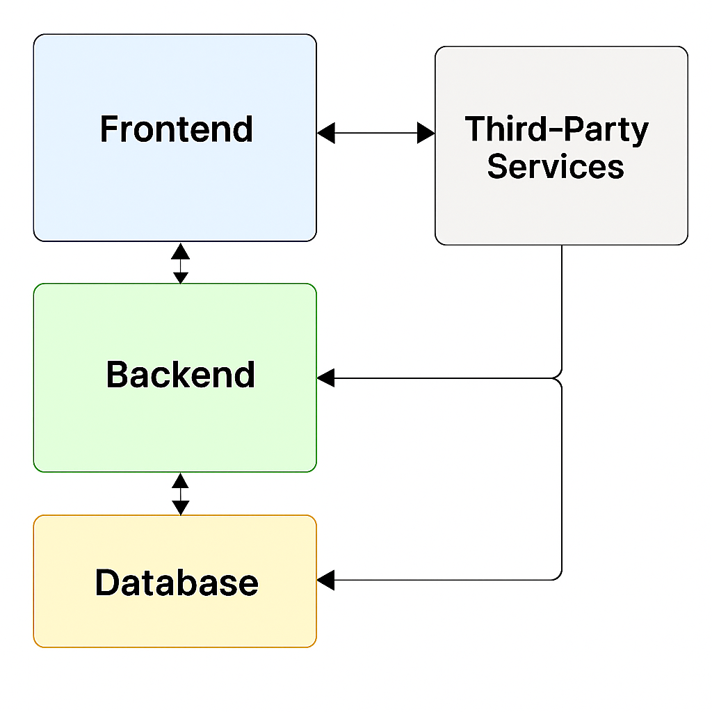

### TODO Task Management Web Application

Task management system designed for organizing todos, subtasks, attachments, and user collaboration.

---

### Hosted URL

**Live Application**: [https://todotaskmanagementwebapplication.onrender.com](https://todotaskmanagementwebapplication.onrender.com)

**Server**:[https://todotaskmanagementwebapplicationserver.onrender.com](https://todotaskmanagementwebapplicationserver.onrender.com)

> ⚠️ Note: The application is hosted on Render. It may take a few moments to start the server when first accessed.

---

### Project Plan

View the detailed planning and feature breakdown here:  
**Notion Doc**: [Todo Task Management Plan](https://www.notion.so/Todo-Task-Management-Web-Application-22781c59f7ba80a9ad9ce52d36b8b2ed?source=copy_link)

---

### Architecture

---

### About the Project

This project was developed as a part of a hackathon organized by [Katomaran](https://www.katomaran.com).

---
